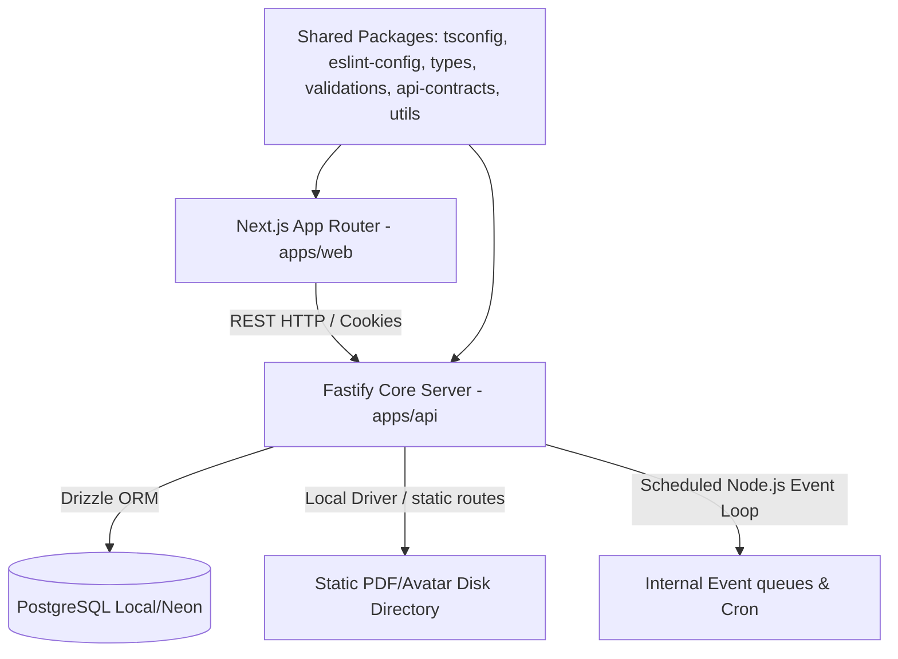

# 02. Technical Requirements Document (TRD)

## System Topology & Communication Model
The platform is organized as a high-performance **pnpm workspaces monorepo** consisting of two key runtimes and shared package modules:

### Communication Principles
- **API Formats**: Pure JSON payloads for requests and responses. All inputs are validated at runtime using `Zod` schemas compiled from `@lms/validations`.
- **CORS Strategy**: Hardened cors origin controls mapping only authorized domains (e.g., `http://localhost:3000` locally).
- **Session Security**: Stateless short-lived JWT access tokens and long-lived database-backed refresh tokens exchanged securely via HTTP-Only, SameSite=Lax cookies.

---

## Core Technologies & Rationale

### 1. Fastify (API Server)
- **Why**: Zero-overhead request execution, native schema compilation (using Ajv or Zod serialization), clean plugin encapsulation ecosystem, and dramatically faster performance than Express.
- **Role**: Validates requests, executes game logic (XP, Streaks, Achievements), handles file uploads, enforces role-based endpoint filters, and logs operations.

### 2. Next.js 14+ App Router (Frontend)
- **Why**: Standard-bearing React framework offering File-based Routing, Server-Side Rendering (SSR) for initial catalog speeds, SEO metadata configuration, and Vercel hosting optimizations.
- **Role**: Handles responsive and dynamic UI structures, controls clientside state slices (Zustand), processes next-intl translations, and maps smooth page-transitional micro-animations.

### 3. Drizzle ORM & PostgreSQL
- **Why**: Zero-compilation overhead, native SQL representation, and full type safety matching generated schemas with runtime objects.
- **Role**: Database migrations and queries. Provides lightweight mapping to Postgres columns, handles relational queries, and simplifies structural queries.

---

## Local Development & Free-Tier Constraints

To ensure zero cost during local and testing phases, we reject heavy cloud dependencies in favor of lightweight local replacements:

| Cloud Standard | Local Development Replacement | Production Migration Path |
|---|---|---|
| **Neon PostgreSQL** | Local Docker / Local Native PostgreSQL | Neon Serverless Postgres (URL swap) |
| **Cloudflare R2** | Local static directory (`apps/api/public/uploads`) served by Fastify | Cloudflare R2 / AWS S3 S3Client |
| **Upstash QStash** | Node-cron / In-memory timeout loops | Upstash QStash HTTP webhooks |
| **Resend API** | Transactional emails piped to local Fastify console log files | Resend SMTP / HTTP Endpoint |
| **Razorpay API** | Simulated local Checkout component with Success/Failure actions | Razorpay Live Orders API & webhooks |

---

## Performance & Scalability Targets

1. **Database Connection Pool**: Configured with a default limit of 15 connections (ideal for local Postgres and Neon Free Tiers), utilizing connection-retry loops.
2. **Resource Caching**: Cache control headers set on all static resources (PDFs, icons, Dicebear avatars) for 1 year.
3. **Optimized Indexes**:
   - Unique index on `users(email)`
   - Compound index on `user_xp(total_xp DESC)` for live leaderboards.
   - Indices on foreign keys `lessons(module_id)`, `quiz_attempts(user_id)`.
4. **Bundle Size Control**: Zero heavy charting libraries or generic component templates. Utilizing pure Tailwind utility styling and framer-motion tree-shaking imports.
