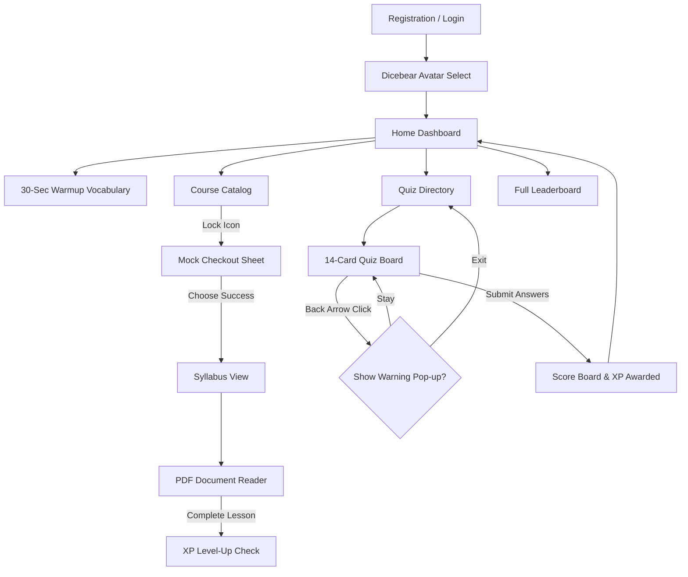
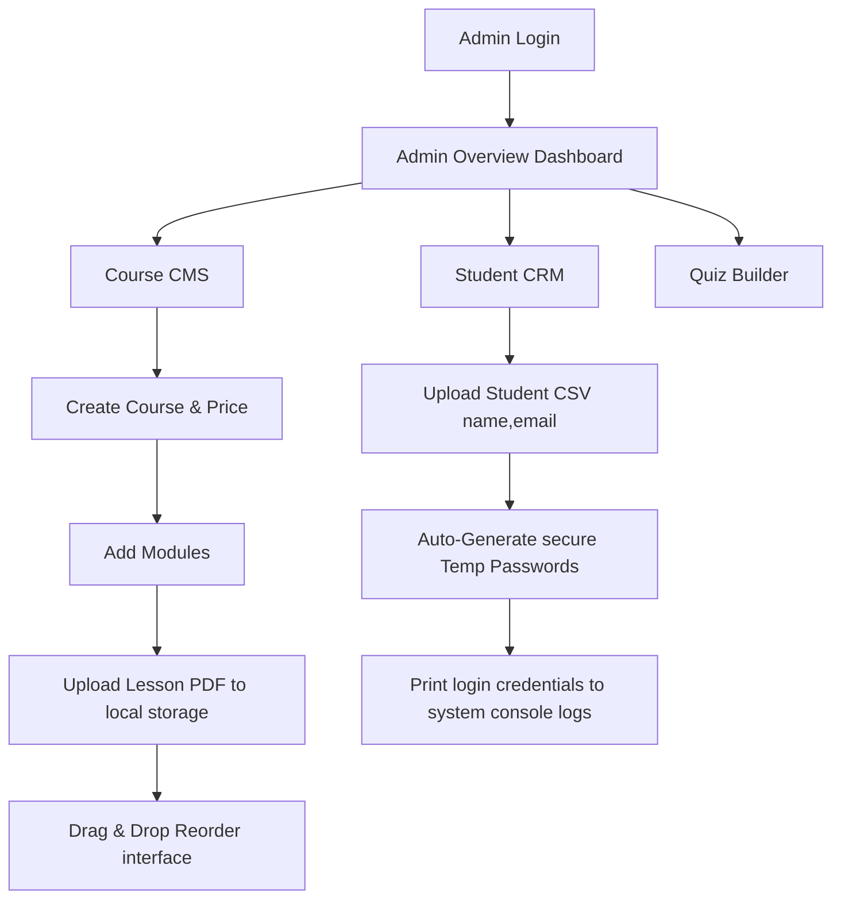
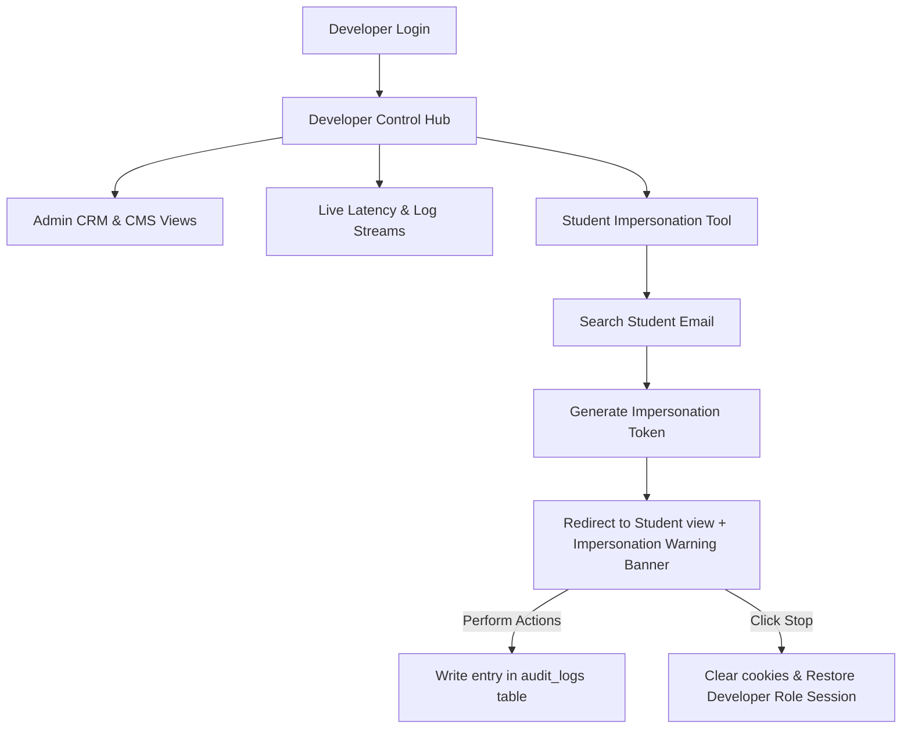

# 04. User Flow & Appflow Document

This document traces the exact navigation loops and state transitions across the Student, Admin, and Developer portals.

---

## 1. The Student Journey

### Steps Description
1. **Onboarding**: The student registers, types credentials, and selects a Dicebear avatar.
2. **Dashboard**: The central hub displaying Time-based greetings, Current Streak (orange flame), current XP progression bar, and top 3 Leaderboard ranking cards.
3. **Mock Checkout**: If a student clicks an unpurchased course, a premium checkout drawer slides open. The student clicks a simulated "Complete Purchase" button (Success or Fail options). A successful response immediately unlocks the syllabus.
4. **Lesson Player**: A clean split-pane window featuring a full-width PDF viewer on the left and a progress-tracking checklist on the right.
5. **Quiz Play**: A single-question card slider. If the student clicks the back arrow mid-quiz, a modal halts progress and warns that their attempt history will be lost.

---

## 2. The Admin Operations Journey

### Steps Description
1. **Course CMS**: Admins can edit modules and courses. They can drag lessons to reorder their layout which triggers instant backend order index updates.
2. **Student CRM**: Contains lists of active students. CSV imports are triggered here. The admin uploads a `.csv` with `name,email` columns. The server responds with temporary credentials printed into the system terminal logs.

---

## 3. The Developer System-Inspection Journey

### Steps Description
1. **Impersonation Protocol**: The developer enters a student's email, which initiates the impersonation flow.
2. **Audit Logging**: During impersonation, all requests must contain the `x-impersonated-by` header, ensuring audit logging records exactly who initiated the action.
3. **Revert Switch**: An absolute floating banner allows the developer to terminate the session instantly, returning the developer to the developer cockpit.
