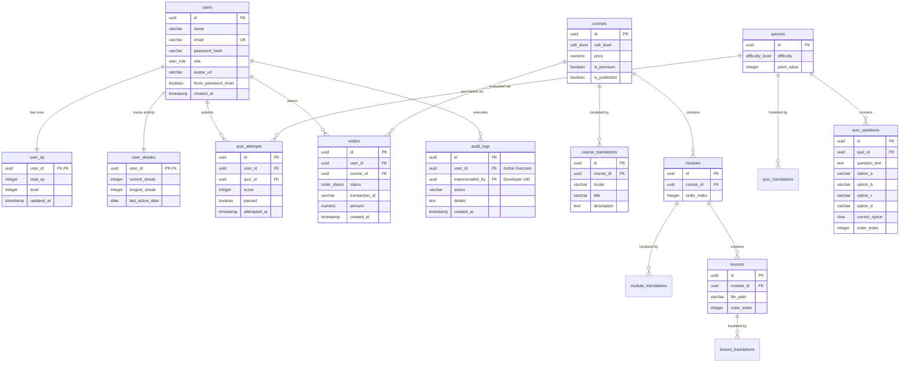

# 21. Entity Relationship (ER) Diagram

This document contains a complete Entity Relationship layout detailing key tables, relations, fields, and enums mapped using Mermaid syntax.

---

## 1. Physical ER Schema

---

## 2. Cardinality Explanations

1. **User Stats & Streaks (`1:1`)**: Each user record is linked to precisely one row in `user_xp` and one row in `user_streaks` generated automatically at signup via database triggers or transaction loops in Fastify.
2. **Dynamic Localization (`1:N`)**: Entities like `courses`, `modules`, `lessons`, and `quizzes` have a **one-to-many** relationship with their translation helper tables. This prevents duplicates and supports infinite localized variations.
3. **Course Syllabus Composition (`1:N`)**: A course contains multiple modules, which in turn contain multiple lessons. Sequential orders are maintained using `order_index` integers.
4. **Quiz attempts log (`1:N`)**: A user can submit infinite attempts for any given quiz, capturing learning history in `quiz_attempts`.
