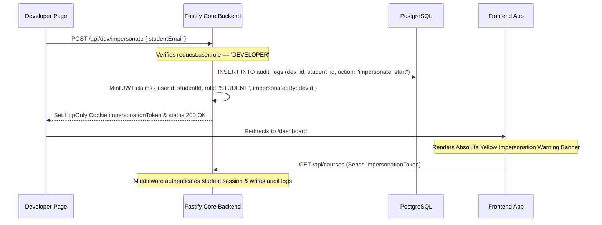

# 24. Developer Dashboard Architecture

This document describes the design of the Developer Control Hub, which is accessible only to users with `role = 'DEVELOPER'`.

---

## 1. System Telemetry & Control Hub

The developer dashboard delivers real-time diagnostic grids:

```text
 ┌────────────────────────────────────────────────────────┐
 │                 DEVELOPER DIAGNOSTIC COCKPIT           │
 ├─────────────────────────┬──────────────────────────────┤
 │      Database Ping      │    Active Connection Pool    │
 │       5ms (Healthy)     │      4 / 15 Connections      │
 ├─────────────────────────┼──────────────────────────────┤
 │    Average Latency      │      Storage Directory       │
 │       64ms (P95)        │      124.5 MB (Local FS)     │
 └─────────────────────────┴──────────────────────────────┘
```

- **Telemetries**: Displays database connection pool stats, endpoint P95 execution speeds, and static storage folders consumption.
- **Log Stream Viewer**: Web interface streaming Fastify console outputs.

---

## 2. Developer Impersonation Lifecycle

Troubleshooting user-specific state bugs can be extremely challenging. To solve this, developers can take complete control of any student session without requiring their password:



### Banner Component UI Design
- Rendered absolutely at the very top of `apps/web` layouts if the store slice session contains `impersonatedBy`.
- Styled in bright amber-yellow (`bg-amber-500 text-slate-900 font-medium py-2 px-4 shadow-lg text-center text-xs tracking-wider`), pushing all navigation headers downwards.
- Contains the warning message: `⚠️ CAUTION: Active Impersonation takeover of {studentEmail}. All actions will be audit-logged.`
- Features a prominent **"Stop Impersonation"** button.

### Revert Mechanism
1. Clicking "Stop Impersonation" sends a POST request to `/api/dev/impersonate/revert`.
2. The Fastify backend deletes the `impersonationToken` cookie.
3. The server logs the session termination (`dev_impersonate_stop` in `audit_logs`).
4. The client redirects the browser back to `/dev`, restoring the developer session.
