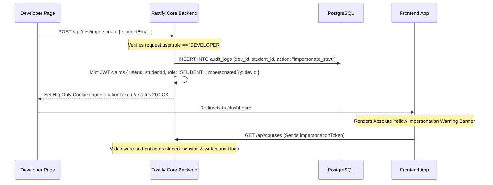

# 24. Developer Dashboard Architecture

This document outlines the design of the Developer Diagnostics & Infrastructure Console, accessible exclusively to users with `role = 'DEVELOPER'`.

---

## 1. Vertical Sidebar Navigation

The Developer Dashboard is integrated into the core vertical navigation framework:
- **Vertical Sidebar Links**:
  - **Dev Console**: The centralized 8-tab diagnostic hub.
  - **API Diagnostics**: Endpoint latency charts (P50, P95, P99) and error rate stats.
  - **System Health**: Health indicators checking database connectivity, cache latency, and background worker queues.
  - **Impersonate Banner**: Amber warnings reminding developers that active student takeover logging is enabled.

---

## 2. Centralized 8-Tab Diagnostic Console

All primary debugging utilities are structured inside `/dev/page.tsx` within an elegant, clutter-free tabbed interface:

1. **User Impersonation**: Jump into any student session without credentials.
2. **Student CRM Overview**: Inspect student records and edit raw metadata.
3. **Stat Overrides**: Add/subtract user XP, unlock badges, and adjust consecutive timezone streaks.
4. **Console & Audit Logs**: Immutable sequence of administrative and security events.
5. **Feature Flags**: Manage gradual rollouts with adjustable percentage dials. Toggles endpoint: `POST /api/dev/feature-flags/toggle`.
6. **Cache Inspector**: Monitor active cache keys, TTL values, and execute instant purging. Purges endpoint: `DELETE /api/dev/cache/:key`.
7. **Reconciliation Report**: Run variance reports comparing DB payment rows against gateway transactions.
8. **Queue Monitor**: Monitor active queue tasks, completed items, and execution durations.

---

## 3. Developer Impersonation Lifecycle

Troubleshooting user-specific state bugs can be extremely challenging. To solve this, developers can take complete control of any student session without requiring their password:

### Banner Component UI Design
- Rendered absolutely at the very top of `apps/web` layouts if the store slice session contains `impersonatedBy`.
- Styled in bright amber-yellow (`bg-amber-500 text-slate-900 font-medium py-2 px-4 shadow-lg text-center text-xs tracking-wider`), pushing all navigation headers downwards.
- Contains the warning message: `⚠️ CAUTION: Active Impersonation takeover of {studentEmail}. All actions will be audit-logged.`
- Features a prominent **"Stop Impersonation"** button.

### Revert Mechanism
1. Clicking "Stop Impersonation" sends a POST request to `/api/dev/unimpersonate`.
2. The Fastify backend deletes the `impersonationToken` cookie.
3. The server logs the session termination (`dev_impersonate_stop` in `audit_logs`).
4. The client redirects the browser back to `/dev`, restoring the developer session.
