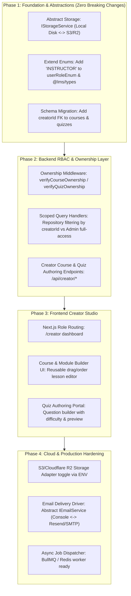

# Antigravity LMS: Production Readiness & Multi-Creator Architecture Plan

## 1. Executive Vision

Transform Antigravity LMS from a **single-admin language learning platform** into an **open, multi-creator, production-grade LMS** where authorized instructors and educators can author, manage, and monetize courses and quizzes, while keeping local development fully functional, reproducible, and lightweight.

---

## 2. Architecture Phases



---

## 3. Detailed Phase Breakdown

### Phase 1: Storage Abstraction & Schema Evolution

#### 1.1 Pluggable Storage Driver (`IStorageService`)
Create an abstract file storage interface so the backend can switch between local filesystem storage and cloud object storage (S3/Cloudflare R2/MinIO) via an environment variable (`STORAGE_DRIVER=local` or `s3`).

- **Interface Definition** (`apps/api/src/common/storage/storage.interface.ts`):
  ```typescript
  export interface FilePayload {
    filename: string;
    mimetype: string;
    file: NodeJS.ReadableStream;
  }

  export interface IStorageService {
    upload(key: string, fileData: FilePayload): Promise<{ publicUrl: string; key: string }>;
    delete(key: string): Promise<void>;
    getPresignedUrl?(key: string, expiresInSeconds?: number): Promise<string>;
  }
  ```
- **Local Implementation** (`LocalStorageService`): Retains current behavior writing to `serverEnv.UPLOAD_DIR` and serving static files from `/public/uploads`.
- **Cloud Implementation Stub** (`S3StorageService`): Uses `@aws-sdk/client-s3` when credentials are supplied, keeping all controller/service code identical.

#### 1.2 Database Schema Updates (`schema.ts`)
1. **Update Enum**:
   ```typescript
   export const userRoleEnum = pgEnum('user_role', ['STUDENT', 'INSTRUCTOR', 'ADMIN', 'DEVELOPER']);
   ```
2. **Update Tables**:
   - `courses`: Add `creatorId: uuid('creator_id').references(() => users.id, { onDelete: 'set null' })`
   - `quizzes`: Add `creatorId: uuid('creator_id').references(() => users.id, { onDelete: 'set null' })`
3. **Update Shared Types** (`packages/types/src/index.ts`):
   - `export type UserRole = 'STUDENT' | 'INSTRUCTOR' | 'ADMIN' | 'DEVELOPER';`
   - Add `creatorId?: string | null;` to `Course` and `Quiz` interfaces.
4. **Migration Strategy**:
   - Run `pnpm run db:generate` and `pnpm run db:push`.
   - Seed existing courses to the initial Admin user so no data is orphaned.

---

### Phase 2: Creator RBAC & Scoped Backend Endpoints

#### 2.1 Ownership Guard Utility (`auth.middleware.ts`)
Ensure that instructors can only read, edit, reorder, or delete resources they own, while admins and developers retain global oversight:

```typescript
export async function verifyCourseOwnership(request: FastifyRequest<{ Params: { id: string } }>, reply: FastifyReply) {
  const user = request.user;
  if (['ADMIN', 'DEVELOPER'].includes(user.role)) return; // Full access

  const courseId = request.params.id;
  const course = await CoursesRepository.findCourseById(courseId);
  if (!course || course.creatorId !== user.id) {
    return reply.status(403).send({ error: 'Forbidden', message: 'You do not own this course' });
  }
}
```

#### 2.2 Creator Service & Repository Scoping
- In `CoursesRepository.findAll(locale, creatorId?)`:
  - If called by public students: return published courses only (`isPublished = true`).
  - If called by an instructor: filter by `creatorId = user.id` (including drafts).
  - If called by an admin: return all courses across all creators.
- In `QuizzesRepository.findAll(creatorId?)`: Same ownership filter logic.

---

### Phase 3: Frontend Creator Studio (`apps/web`)

#### 3.1 Role Guard & Navigation
- Extend Next.js middleware and auth store:
  - If `user.role === 'INSTRUCTOR'` -> redirect to `/creator` or provide access to course authoring workspace.
  - Add navigation item for "Creator Studio" in the navbar for instructors, admins, and developers.

#### 3.2 Creator UI Modules
1. **Dashboard** (`/creator`):
   - Overview of created courses, active student enrollments, and quiz attempts.
   - Quick "Create Course" CTA button.
2. **Course Editor** (`/creator/courses/[id]`):
   - Metadata editor (title, description, CEFR level, price, publication toggle).
   - Module organizer: Add modules, edit module titles.
   - Lesson organizer: Add lessons, upload video/PDF courseware, drag-and-drop or button reordering (`PUT /api/admin/modules/:id/lessons/reorder`).
3. **Quiz Editor** (`/creator/quizzes/[id]`):
   - Add/edit multiple-choice questions, set difficulty, test student preview mode.

---

### Phase 4: Production Hardening & Cloud Transition

#### 4.1 Storage Switch
- Provide `.env.example` keys:
  ```env
  STORAGE_DRIVER=local # 'local' | 's3'
  S3_ENDPOINT=
  S3_BUCKET=
  S3_ACCESS_KEY_ID=
  S3_SECRET_ACCESS_KEY=
  S3_REGION=
  ```
- Fastify dynamically instantiates `LocalStorageService` if `STORAGE_DRIVER === 'local'` or if S3 credentials are missing, ensuring seamless fallback.

#### 4.2 Email Driver Abstraction (`IEmailService`)
- Current: Mock console logger in `AdminService.sendMessageToStudent`.
- Plan: Implement `ConsoleEmailService` (current) and `ResendEmailService` / `SmtpEmailService` via an abstraction interface.
- Complete the remaining 94th item from `checklist.md`: **Email Templates Management Portal**.

#### 4.3 Background Worker Preparation
- Define a lightweight task runner abstraction (`dispatchJob(taskType, payload)`).
- Run inline in local dev mode.
- In production, route `dispatchJob` to **BullMQ** with a Redis instance for heavy tasks (video transcoding, bulk student CSV import, mass email notifications).

---

## 4. Implementation Schedule & Milestones

| Milestone | Deliverables | Risk Level |
|---|---|:---:|
| **Milestone 1** | Abstract `IStorageService` + `LocalStorageService` drop-in replacement | Low |
| **Milestone 2** | DB migration: `INSTRUCTOR` enum + `creatorId` columns on courses & quizzes | Low |
| **Milestone 3** | Backend route ownership guards & creator endpoints | Medium |
| **Milestone 4** | Frontend Creator Studio portal (`/creator`) | Medium |
| **Milestone 5** | Email Templates Portal (closing feature #94) & S3 Driver | Low |
